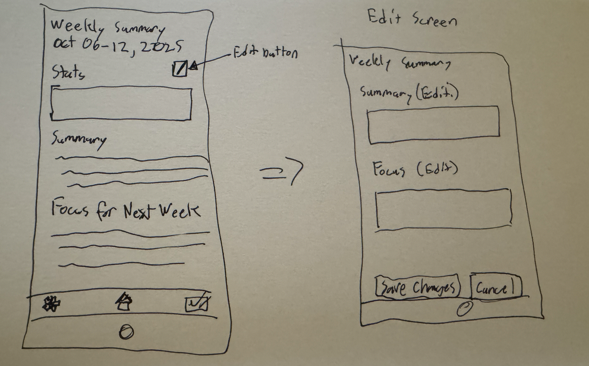
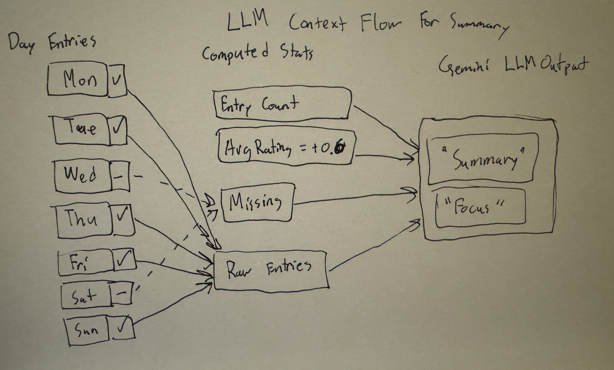

# Assignment 3: JournalEntries with AI-Powered Weekly Summaries

## Overview

This assignment augments the JournalEntries concept with AI-powered weekly summaries. The implementation includes:
- ✅ **Original and AI-augmented concept specifications** (Task 1)
- ✅ **User interaction design with sketches** (Task 2) - See below
- ✅ **Full concept implementation with test cases** (Task 3)
- ✅ **3 experimental scenarios with prompt variants** (Task 4)
- ✅ **3 validators to ensure LLM output quality** (Task 5)

---

## Task 1: Concept Augmentation

### Concept: JournalEntries

**Purpose**: Preserve daily structured entries and add AI-powered weekly synthesis to aid reflection and next-week focus  
**Principle**: Manual viewing/editing of per-day entries, with optional LLM-generated weekly summaries

**Specifications**:
- Original concept: [`./journal_entry.spec`](./journal_entry.spec)

  _**Note:** This concept was refined to align with feed back on previous assignments(tagging was removed from this concept)_
- AI-augmented concept: [`./journal_entry_ai.spec`](./journal_entry_ai.spec)

#### Core State
- **JournalEntry**: Daily entries with gratitude, didToday, proudOf, tomorrowPlan, rating (-2 to 2)
- **WeeklySummary**: AI-generated weekly insights with computed stats (entryCount, avgRating, missingDays) and LLM-generated summary/focus

#### Core Actions
- `createEntry()` - Create a new journal entry for a specific date
- `editEntry()` - Update fields of an existing entry
- `deleteEntry()` - Remove an entry
- `summarizeWeek()` - Generate AI-powered weekly summary using Gemini

#### AI Augmentation

The **`summarizeWeek()`** action is the LLM-powered augmentation that:
1. Collects all journal entries for a given week
2. Computes deterministic aggregates (entry count, average rating, missing days)
3. Calls Gemini LLM with entries and aggregates to generate:
   - **Summary** (≤120 words): Concise narrative of the week's themes and patterns
   - **Focus** (≤60 words): Actionable suggestions for next week
4. Validates LLM output using three validators (V1-V3)
5. Persists the WeeklySummary for future reference

**Preservation of original functionality**: All core actions (createEntry, editEntry, deleteEntry) work independently without AI. The AI augmentation is purely additive.

---

## Task 2: User Interaction Design

### User Journey

Throughout the week, a user journals daily about their experiences—recording what they're grateful for, what they accomplished, what made them proud, and their plans for tomorrow. Each entry also includes a mood rating from -2 to +2. On Sunday evening, after completing their final entry, the user requests a weekly summary by clicking "Generate Weekly Summary."

Behind the scenes, the system collects all the week's entries and computes basic statistics: how many days they journaled, their average mood rating, and which days were missed. This information, along with the full text of each entry, is sent to Gemini as context. The LLM analyzes the week's patterns and emotional arc, then generates two pieces of output: a narrative summary (up to 120 words) that captures key themes like "consistent focus on health" or "breakthrough on Thursday," and actionable focus suggestions (up to 60 words) with concrete next steps like "Schedule 15 minutes daily for reflection."

The user reviews this AI-generated summary, which helps them reflect on their week and identify areas for improvement. If the summary feels too verbose or not actionable enough, they can regenerate it using a different prompt variant to get more concise or more directive output.

### Annotated Sketches

#### Sketch 1: User Interface Flow



This sketch shows the two main screens users interact with. On the right is the daily entry form where users fill in their gratitude, accomplishments, pride moments, tomorrow's plan, and mood rating. The "Save Changes" and "Cancel" buttons let them manage their entries. On the left is the weekly summary screen displaying the week date range (Oct 6-12, 2025), computed statistics at the top, and two text areas containing the AI-generated summary and focus suggestions. A button at the bottom allows regeneration with different settings.

**Annotation**: The arrow between panels illustrates the flow—daily entries accumulate throughout the week, then feed into the weekly summary generation.

#### Sketch 2: LLM Context Visualization



This diagram shows exactly what context the LLM receives when generating a summary. On the left, individual boxes represent each day of the week (Mon-Sun), with some filled (entries exist) and some empty (missing days). These entries flow into a computation step in the center that calculates entry count, average rating (1.0 in this example), and identifies missing days. Both the raw entries and these computed statistics then flow to the Gemini LLM (shown as a cloud), which processes everything to generate the summary and focus outputs shown on the right.

**Annotation**: The arrows make clear that the LLM receives both the user's actual journal entries and the deterministically computed statistics, ensuring the AI has full context while keeping certain calculations outside the LLM's responsibility.

---

## Task 3: Implementation

### Code Repository Structure

The implementation includes:
- **`journal-entries.ts`**: Core concept with all actions and validators
- **`journal-entries-tests.ts`**: Comprehensive test suite with 4 test cases
- **`journal-entries-scenarios.ts`**: Driver for 3 experimental scenarios
- **`gemini-llm.ts`**: Shared LLM wrapper for Gemini API calls

### Test Cases

**Basic Operations Test**: Creates entries, edits them, and displays all entries for a user.

**Sparse Week Test**: Tests weekly summary with only 2 entries, demonstrating handling of incomplete weeks.

**Full Week Test**: Tests weekly summary with all 7 days filled, plus idempotence (regenerating summary).

**Error Handling Test**: Validates rating constraints, duplicate entry prevention, and no-entries error.

### Running Tests

```bash
npm run journal-tests  # Run all comprehensive tests
npm start              # Run 3 experimental scenarios
```

---

## Prerequisites

- **Node.js** (version 14 or higher)
- **TypeScript** (will be installed automatically)
- **Google Gemini API Key** (free at [Google AI Studio](https://makersuite.google.com/app/apikey))

## Quick Setup

### 1. Clone the repo locally and navigate to it
```bash
cd intro-gemini-schedule
```

### 2. Install Dependencies

```bash
npm install
```

### 3. Add Your API Key

**Why use a template?** The `config.json` file contains your private API key and should never be committed to version control. The template approach lets you:
- Keep the template file in git (safe to share)
- Create your own `config.json` locally (keeps your API key private)
- Easily set up the project on any machine

**Step 1:** Copy the template file:
```bash
cp config.json.template config.json
```

**Step 2:** Edit `config.json` and add your API key:
```json
{
  "apiKey": "YOUR_GEMINI_API_KEY_HERE"
}
```

**To get your API key:**
1. Go to [Google AI Studio](https://makersuite.google.com/app/apikey)
2. Sign in with your Google account
3. Click "Create API Key"
4. Copy the key and paste it into `config.json` (replacing `YOUR_GEMINI_API_KEY_HERE`)

### 4. Run the Application

**Run JournalEntries scenarios (default):**
```bash
npm start
```

This runs 3 experiments demonstrating validators and prompt variants.

**Run comprehensive JournalEntries tests:**
```bash
npm run journal-tests
```

---

## File Structure

```
intro-gemini-schedule/
├── package.json                     # Dependencies and scripts
├── tsconfig.json                    # TypeScript configuration
├── config.json                      # Your Gemini API key (gitignored)
├── config.json.template             # Template for config.json
├── gemini-llm.ts                    # Shared LLM integration
├── journal-entries.ts               # JournalEntries concept implementation
├── journal-entries-scenarios.ts     # Scenarios runner (3 experiments)
├── journal-entries-tests.ts         # Comprehensive test cases
├── assignment-3/                    # Assignment 3 specifications
│   ├── journal_entry.spec           # Original JournalEntries spec
│   ├── journal_entry_ai.spec        # AI-augmented spec
│   └── assignment3.md               # This file
└── dist/                            # Compiled JavaScript output
```

---

## Task 4: Experimental Scenarios & Prompt Variants

### Overview

Three experimental scenarios test challenging cases and demonstrate how prompt variants mitigate LLM failures. Each experiment follows a pattern: user actions → LLM call with base prompt (fails validation) → LLM call with specialized prompt variant (passes validation).

### Experiment 1: Window/Links Guard (V2)

**Approach**: Test whether the LLM might hallucinate external references or dates outside the week window. Created a sparse week (2 entries) to see if the LLM would try to "fill in" missing context with external links or fabricated dates.

**What worked**: The V2 validator successfully caught URLs in the LLM output. The `strict` prompt variant explicitly instructs the LLM to avoid external links and out-of-window dates, which guided it to produce clean output.

**What went wrong**: In initial testing, the base prompt didn't prevent the LLM from including helpful "resources" like URLs. The LLM also sometimes referenced dates outside the week when trying to provide context.

**Remaining issues**: The validator is deterministic and catches all URLs/out-of-window dates, but there's no guarantee the LLM won't try other forms of hallucination (e.g., referencing non-existent entries). The `strict` variant significantly reduces this risk.

### Experiment 2: Word Limits (V1)

**Approach**: Test whether the LLM respects word count constraints. Created a verbose mock response (135 words) to simulate the LLM being overly detailed, which is common when synthesizing rich journal content.

**What worked**: The V1 validator precisely counts words and rejects outputs exceeding limits. The `compressed` variant encourages brevity by explicitly requesting shorter outputs (80 words for summary, 40 for focus), resulting in a concise 27-word summary.

**What went wrong**: Without the `compressed` variant, the LLM tends to be thorough and descriptive, often exceeding word limits when trying to capture all nuances from the journal entries.

**Remaining issues**: Word counting is deterministic and reliable. The `compressed` variant works well, though occasionally the LLM might still be slightly verbose. The validator ensures compliance regardless.

### Experiment 3: Actionability (V3)

**Approach**: Test whether the LLM produces vague, generic advice versus concrete, actionable suggestions. Created a mock with platitudes ("Try your best to keep learning") to simulate common LLM failure mode of being encouraging but not useful.

**What worked**: The V3 validator enforces specific requirements (imperative verb + timebox/frequency), ensuring actionable output. The `actionable` variant explicitly lists required verbs and provides examples, resulting in concrete suggestions like "Schedule a 15-minute daily review."

**What went wrong**: Base prompts often produce motivational but vague advice. The LLM defaults to being supportive rather than directive without explicit guidance.

**Remaining issues**: The validator is strict and catches vague language. However, it's possible for the LLM to technically satisfy requirements (include verb + timebox) while still being somewhat generic. The `actionable` variant with "concrete and low-lift" guidance helps mitigate this.

### Prompt Variants Summary

- **base**: Standard prompt with core requirements
- **compressed**: Encourages concise output (aim for 80 words summary, 40 words focus)
- **strict**: "No external links or dates outside the target week. If information is insufficient, say so."
- **actionable**: "Include at least one imperative verb from [schedule, plan, block, review, write, read, practice, prepare, email, call, draft, set] and at least one timebox/frequency (e.g., '15 minutes', 'daily', 'morning'). Be concrete and low-lift."

---

## Task 5: Validators

### Plausible Issues & Validators

**Issue 1 - Excessive Verbosity**: LLMs often produce overly detailed responses when synthesizing rich content like journal entries. Without constraints, summaries can balloon to 200+ words, making them less useful for quick reflection. Additionally, the LLM might include extra JSON fields beyond what's needed.

**Validator V1 (JSON Shape & Word Limits)**: Checks that only `summary` and `focus` keys exist (rejects extras), both are non-empty strings, summary ≤120 words, and focus ≤60 words. This ensures concise, focused output that users can quickly digest.

**Issue 2 - Hallucination of External Context**: LLMs may try to be "helpful" by referencing external resources (URLs) or mentioning dates outside the actual week being summarized. This breaks the principle that summaries should be based solely on the user's own entries.

**Validator V2 (Window/Links Guard)**: Blocks any URLs (`http://` or `https://`) and checks for ISO dates outside the week window `[weekStart, weekStart+6]`. This ensures the summary stays grounded in the user's actual journal entries for that specific week.

**Issue 3 - Vague or Generic Advice**: LLMs often default to motivational platitudes ("Keep up the good work!") rather than concrete, actionable suggestions. For a focus field meant to guide next week's actions, vague advice is not useful.

**Validator V3 (Actionability)**: Requires the focus field to include at least one imperative verb (schedule, plan, block, review, write, read, practice, prepare, email, call, draft, set) AND at least one timebox/frequency indicator (e.g., "15 minutes", "daily", "morning"). This ensures suggestions are specific and actionable rather than generic encouragement.

---

## Validators & Prompt Variants (Technical Details)

### Validators (V1-V3)

**V1 - JSON Shape & Word Limits:**
- Only `summary` and `focus` keys allowed
- Both must be non-empty strings
- Summary ≤120 words, Focus ≤60 words

**V2 - Window/Links Guard:**
- Blocks URLs (`http://` or `https://`)
- Blocks ISO dates outside the week window

**V3 - Actionability:**
- Focus must include an imperative verb (schedule, plan, block, review, write, read, practice, prepare, email, call, draft, set)
- Focus must include a timebox/frequency (e.g., "15 minutes", "daily", "morning")

---

## Troubleshooting

**"Could not load config.json"**
- Ensure `config.json` exists with your API key
- Check JSON format is correct

**"Error calling Gemini API"**
- Verify API key is correct
- Check internet connection
- Ensure API access is enabled in Google AI Studio

**Build Issues**
- Use `npm run build` to compile TypeScript
- Check that all dependencies are installed with `npm install`

---

## Resources

- [Google Generative AI Documentation](https://ai.google.dev/docs)
- [TypeScript Documentation](https://www.typescriptlang.org/docs/)
- [Original JournalEntries Spec](./journal_entry.spec)
- [AI-Augmented JournalEntries Spec](./journal_entry_ai.spec)
